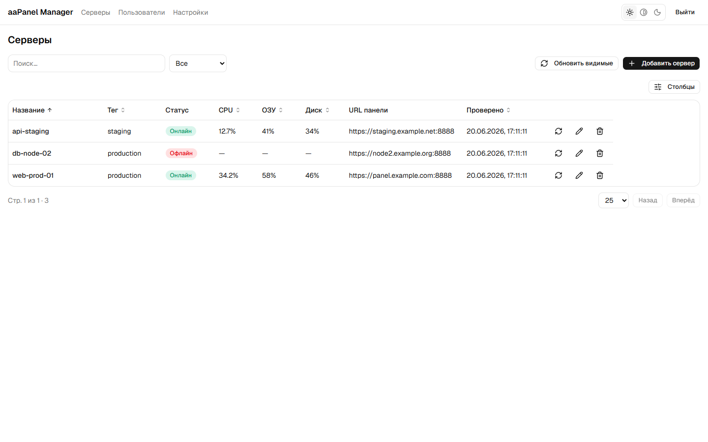
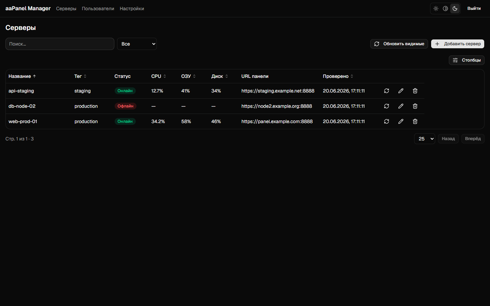
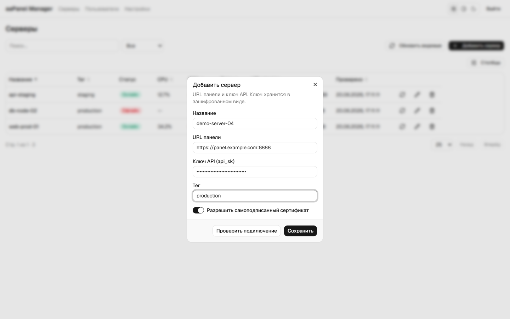
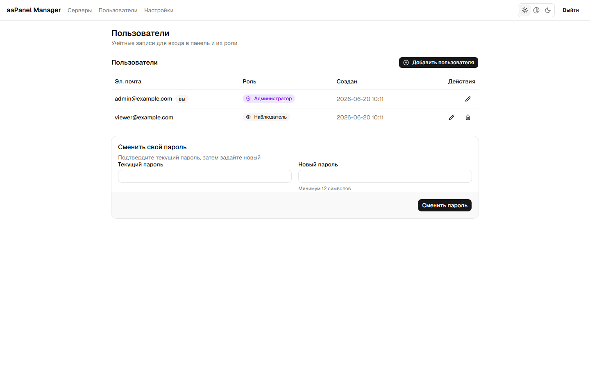
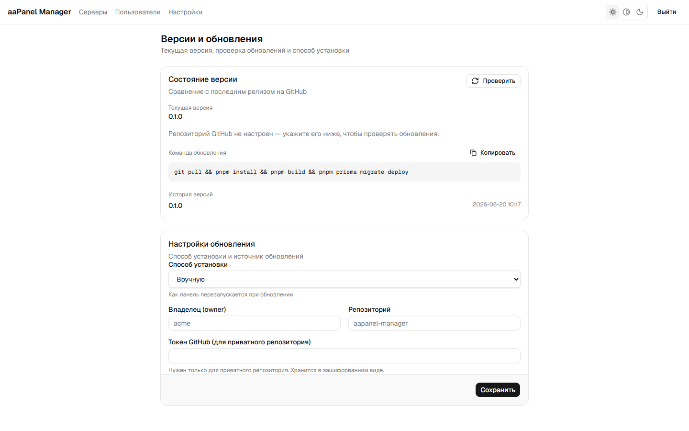

# aaPanel Manager

> Self-hosted панель для управления парком серверов **aaPanel** из одного места:
> Node.js-проекты, базы данных, живой мониторинг и массовые операции сразу на многих машинах.

🌍 **Язык:** **Русский** · [English](README.md)

[](https://github.com/aapanel-tools/aapanel-manager/actions/workflows/ci.yml)
[](LICENSE)

---



## Зачем это

[aaPanel](https://www.aapanel.com/) (международная версия панели BT Panel) — популярная
веб-панель управления Linux-сервером. На одном сервере она хороша; когда серверов десятки,
в каждую панель приходится заходить отдельно, а одну и ту же операцию повторять руками
столько раз, сколько у вас машин.

aaPanel Manager решает именно это. Он подключается к панелям по их HTTP API и даёт единый
интерфейс поверх всего парка: общий список серверов с живыми метриками, управление
проектами и базами, массовые операции с отчётом по каждому серверу и журнал того,
кто что сделал.

Приложение **self-hosted**: работает на вашем сервере, ключи `api_sk` хранятся
зашифрованными (AES-256-GCM) и никогда не попадают в браузер — панель всегда вызывается
через бэкенд-прокси.

Покрытие API восстановлено и проверено на живых панелях aaPanel v8, включая то, чего
официальная документация не описывает.

## Возможности приложения

- 🖥️ **Мульти-сервер** — добавление / изменение / удаление серверов aaPanel; `api_sk` шифруется в покое (AES-256-GCM)
- 🟢 **Node.js-проекты** — список, статус, инфо, логи, старт / стоп / рестарт, создание / изменение / удаление
- 📊 **Живой мониторинг** — CPU / RAM / диск с автообновлением (фоновый опрос в процессе + Server-Sent Events)
- 👥 **Пользователи и роли** — admin / viewer, управление пользователями, смена своего пароля
- 🗄️ **Базы данных** — MySQL и PostgreSQL в одной таблице (у каждого движка свой API); создание и удаление с подтверждением вводом имени
- ⚡ **Массовые операции** — одна операция на многих серверах: предпросмотр, первый сервер в одиночку, остановка при первой ошибке, отчёт по каждому и отмена
- 📓 **Журнал операций** — кто что изменил, на каком сервере и чем это кончилось
- 🔒 **Безопасно по умолчанию** — бэкенд-прокси; секреты не попадают в браузер; сертификат панели закрепляется по отпечатку, а не принимается на веру
- 🌐 **i18n и темы** — английский / русский, светлая / тёмная

> **Статус:** в активной разработке. Мульти-сервер, Node.js-проекты, базы данных, мониторинг, массовые операции, журнал операций и управление пользователями работают уже сейчас. Файлы, FTP, cron и firewall пока есть в документации API и в планах для приложения.

## Скриншоты

|  |  |
|---|---|
| **Серверы (тёмная тема)**<br> | **Добавление сервера**<br> |
| **Пользователи и роли**<br> | **Версии и обновления**<br> |

## Стек

Next.js 16 (App Router · React Server Components · Server Actions) · React 19 · TypeScript · Prisma 7 + PostgreSQL · Auth.js v5 · Tailwind v4 · Docker.

## Быстрый старт (разработка)

**Требования:** Node 24, pnpm 11 (`corepack enable`), PostgreSQL.

```bash
git clone https://github.com/aapanel-tools/aapanel-manager.git
cd aapanel-manager/web
pnpm install
cp .env.example .env          # задай DATABASE_URL, AUTH_SECRET, APP_ENCRYPTION_KEY
pnpm prisma migrate deploy
pnpm dev                      # http://localhost:3000
```

Для продакшена (Docker-образы, релизы по тегу, самообновление) см. [docs/RELEASING.md](docs/RELEASING.md).

## Планы

- [x] Несколько серверов: добавление, проверка подключения, шифрование ключей
- [x] Node.js-проекты: список, статус, логи, запуск / остановка / перезапуск, создание и изменение
- [x] Базы данных: MySQL и PostgreSQL в одной таблице, создание и удаление
- [x] Живой мониторинг: CPU / RAM / диск, фоновый опрос и обновление по SSE
- [x] Массовые операции: предпросмотр, канареечный сервер, остановка при первой ошибке, отчёт по каждому
- [x] Журнал операций, пользователи и роли
- [x] Пиннинг TLS-сертификата панели по отпечатку
- [x] Версии и обновление: релизы по тегу, Docker-образ, самообновление
- [ ] Сайты, файлы, FTP, cron, firewall
- [ ] Оповещения и сводка по всему парку

## Дисклеймер

Неофициальный инструмент, не связанный с разработчиками aaPanel. Проверено на aaPanel v8;
поведение панели может меняться между версиями. Официальная документация панели:
[aapanel.com/docs](https://www.aapanel.com/docs/).

## Лицензия

Copyright (c) 2026 vsgrade.

[GNU Affero General Public License v3.0](LICENSE) — программу можно запускать, изучать,
изменять и распространять. Если вы её изменили и дали пользоваться другим по сети,
исходный код изменённой версии должен быть доступен им на тех же условиях.
